# 🏁 Stay on Track @ Phänomena on Tour 2026

**Authors: Roberto Minelli & Samuele Pasini (Software Institute – USI, Lugano)**

This is the guide for the daily usage of the Piracer Car for the Stay on Track: Phäenomena Exhibition by Università della Svizzera Italia.

This guide will be structured as follows: The first part covers the [Daily Usage](#daily-usage-basics), the second the [Troubleshooting](#troubleshooting), and the last one is a [Question & Answers (Q&A) section](#q--a) helpful to build the theoretical concepts and to answer to the audience.

## Daily Usage: Basics

### Screens
1. Turn on the  beamer using its remote
2. Turn on the touchscreen using its remote
3. Turn on the Samsung display mounted on the side of the wooden structure that holds the beamer

### Cars
1. Choose one of the cars, i.e., `piracer-x`
2. Turn it on using the `ON/OFF` button
3. Wait until the small on-board OLED display on the car turns on
4. Check if the battery is full (100%)

   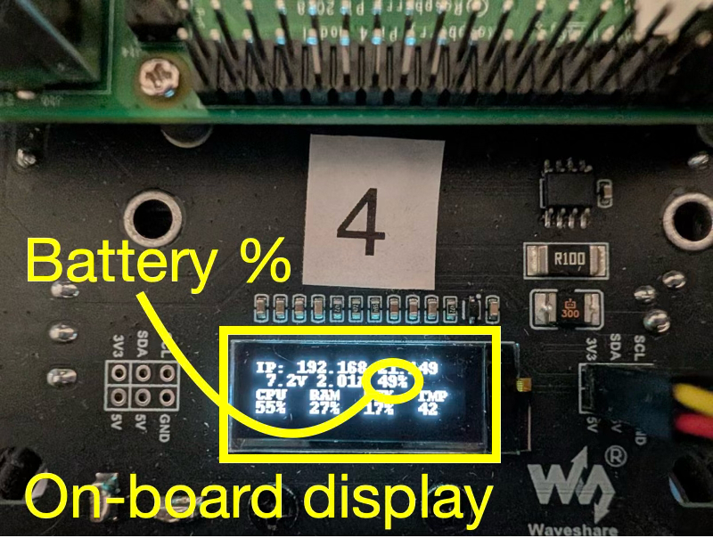

5. If so, put the car on the raised wooden floor
7. Otherwise, turn off the car, put it under charge, and select a car with full battery

### Laptops
1. Ensure that both laptops (#1 and #2) are connected to the power outlets (otherwise connect them)
2. Use the `formulausi` account with the password: `phaenomena2026!`
3. Ensure the Google Chrome option `View > Always Show Toolbar in Full Screen` is disabled
   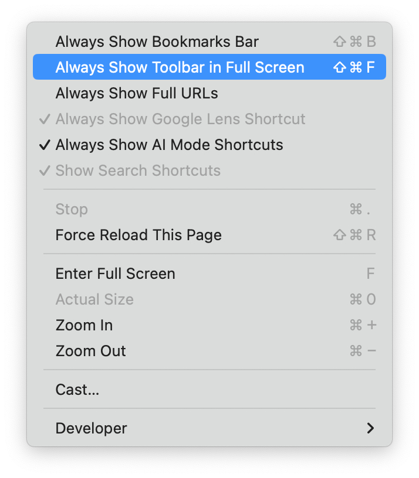 Always Show Toolbar in Full Screen" width="300px"/>
5. Refer to the following section to configure the screens on the two laptops

### Configuration of the screens

#### Laptop #1 (Control Center)
1. This laptop should have the following connections:
  - USB-C (with HDMI adapter) to connect the beamer (extended screen)
  - HDMI to connect the video to the touchscreen (extended or mirrored screen)
  - USB-C to connect the touch interface to the touchscreen 
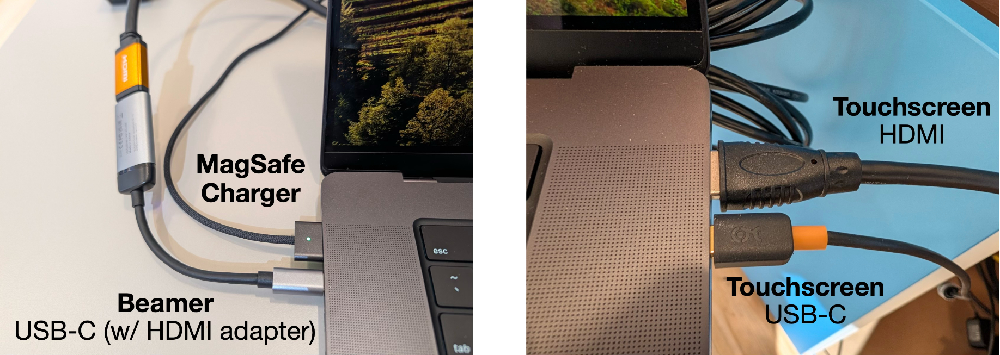
2. Open [System Settings](https://support.apple.com/en-gb/guide/imac/apda966cb8af/mac) and navigate to "Displays" settings
3. Configure the touchscreen (PLT4339U) as `Main Display` as `Extended Screen` following [this guide](https://support.apple.com/en-is/guide/mac-help/mchlb5f905a1/mac)
4. Configure the Built-in Display as `Mirror for PLT4339U`
5. Configure the beamer (PT-REQ12EJ) as  `Extended Screen` following [this guide](https://support.apple.com/en-is/guide/mac-help/mchlb5f905a1/mac)
6. ⚠️ **Ensure that in the Settings of the [Touch-Up](https://github.com/shueber/Touch-Up) driver `Send mouse events to` is set to `PLT4339U`**
7. To ensure that your mouse moves correctly between monitors, it is recommended to rearrange the position of your screens. To do so, click on the "Arrange" button (in "Displays" settings) and adjust the virtual display position to match your desired setup. Below you can find the recommended settings and arrangement
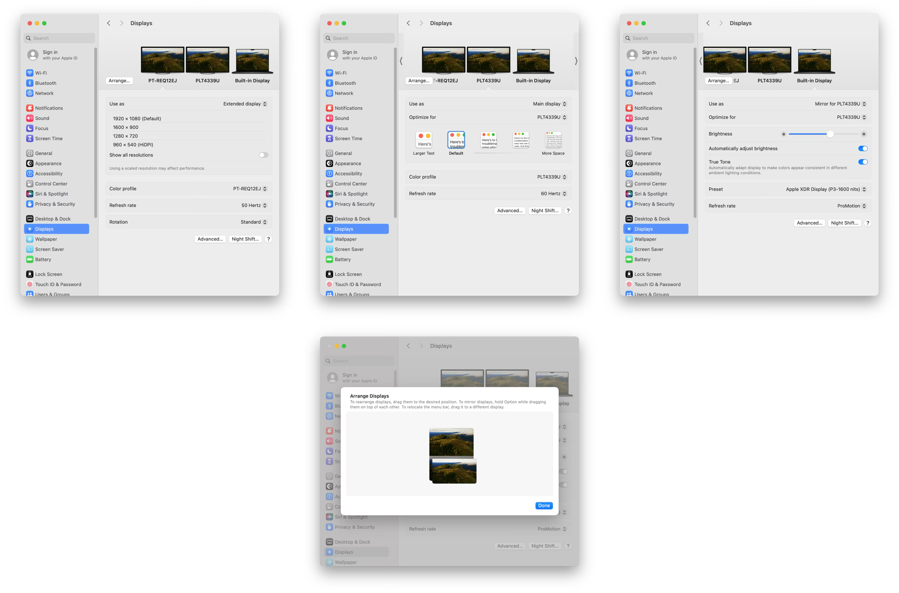

### Laptop #2 (Pit-stop)
1. This laptop should have the following connection:
  - HDMI to connect the screen mounted on the side of the structure (extended screen)
2. Open [System Settings](https://support.apple.com/en-gb/guide/imac/apda966cb8af/mac) and navigate to "Displays" settings
3. Configure the screen as `Extended Screen` following [this guide](https://support.apple.com/en-is/guide/mac-help/mchlb5f905a1/mac)
4. To ensure that your mouse moves correctly between monitors, it is recommended to rearrange the position of your screens. To do so, click on the "Arrange" button (in "Displays" settings) and adjust the virtual display position to match your desired setup

<!--
4. Click on one of the external display icons in the visual layout
5. Select the "Use as" dropdown menu and choose "Mirror for [Name of the other external monitor]"
6. Ensure the built-in display is not included in the mirroring set
-->

### Touchscreen settings with MacOS
To enable touchscreen interactivity with MacOS, we installed the [Touch-Up](https://github.com/shueber/Touch-Up) driver. Please ensure the configuration of the driver are as follows: 

<p align="center">
  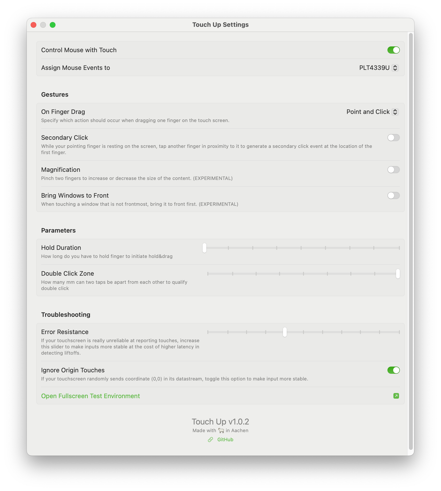 
</p>

### Cables
The overall cabling should be as follows:
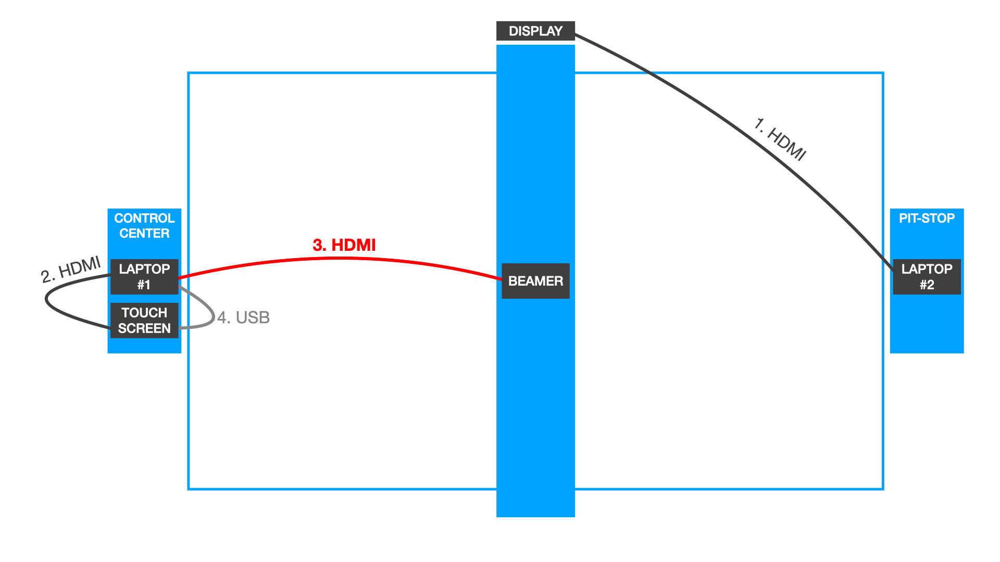

## Daily Usage: Laptop #1 (Control Center)

### Connect to the car

1. Turn on one of the cars (e.g., `piracerpro-x`)
2. Connect laptop #1 to `piracerpro-x` via SSH. The procedure is the same to enstablish the connection with every piracer car, e.g., `piracerpro-1`, `piracerpro-2`, ...):

Simply open the Terminal and run:
``` bash
ssh piracerpro-x
```

3. Keep this Terminal open.

### Path-ological: The Circuit Editor Application

The Path-ological application should run on laptop #1.

1. Navigate to the project directory
```bash
cd ~/path-ological
```

2. Start the application
```bash
pnpm run dev
```

3. Access the editor interface at [`localhost:5173/editor`](http://localhost:5173/editor)
4. Put the editor interface on fullscreen on the touchscreen (connected via HDMI to the laptop)
5. Access the client interface at [`localhost:5173`](http://localhost:5173)
6. Put the client interface fullscreen on the beamer (connected via HDMI to the laptop)

The usage of the application (that should be described to the participants) will be shown during the training days.

## Daily Usage: Laptop #2 (Pit-Stop)

### Connect to the car
On laptop #2, connect to one of the cars (e.g., `piracerpro-x`):
```bash
ssh piracerpro-x
```

### Run the Autonomous Driving Model

Now you can run the model, by default the model name will be `location_full.pt`, for example in Dietikon it will be `dietikon_full.pt`.
The usage of different models will be discussed during the training day.

1. Run the following command:
```bash
python manage.py drive --model models/MODEL_NAME.pt
```

2. Access the drive interface at [`localhost:8887/drive`](http://localhost:8887/drive)
3. Keep this interface on the screen of laptop #2
4. Access the cockpit at [`localhost:8887/cockpit`](http://localhost:8887/cockpit)
5. Move the cockpit on the display mounted on the side of the wooden structure that holds the beamer
6. On the drive interface set the `(M)ode` to `Full (A)uto`:

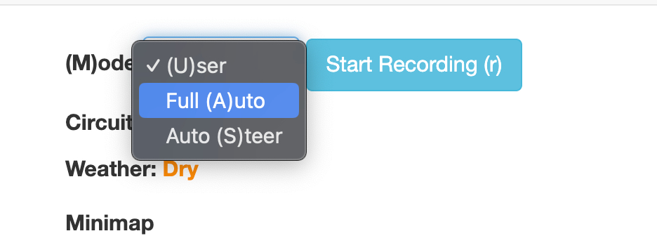

8. Slowly move the `AI multiplier` (which is initially set to 0.00) to values close to 1.00 (not less than 0.85). You might need to change this value after a few hours of operation, when the battery of the cars goes down (i.e., lower the battery, higher the multiplier).

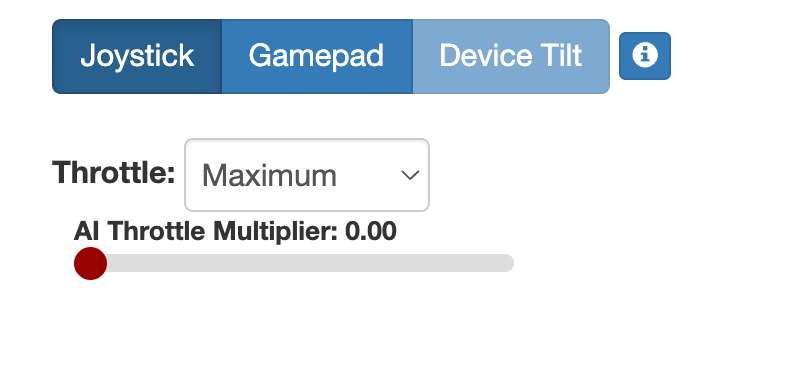

In case you want to stop the car, you can move back the `AI multiplier` to 0.00 or set the `(M)ode` to `(U)ser`

When you change the circuit and the scenario (i.e., surface and weather) on Path-ological, be sure that laptop #1 is also connected with SSH to the car (otherwise it will not be able to propagate the changes to car).

You can test the connection by changing the circuit, save it, and observing if there are changes in Circuit, Weather and Minimap:

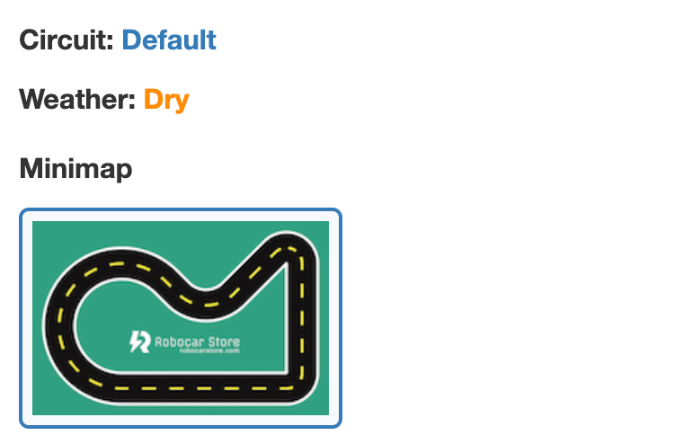

## End of the day

At the end of the day, you should follow this routine.

**Laptop #1 (Control Center)**

1. Close the SSH session by closing the Terminal connected to the car
2. If `autoplay` is active, turn it off
3. Put the laptop to sleep (without closing the lid)

We recommend to **leave all the screens connected** and to ease the startup on the next day.

**Laptop #2 (Pit-stop)**

1. Move the AI multipler to 0.00 on the drive interface
2. Close the browser running the drive interface
3. Close the browser running the cockpit
3. Stop the drive application by pressing `control+C` on the Terminal you used to run the driving script (`python manage.py drive --model models/MODEL_NAME.pt`).
4. Close this Terminal
5. Put the laptop to sleep by closing the lid

**Screens**
1. Put the beamer in standby using its remote
2. The touchscreen should automatically go in standby when you put the laptop in standby (if not, turn it off with its remote)
3. Turn off the Samsung display mounted on the side of the wooden structure that holds the beamer

**Important** 
1. Remember to put all the laptop in charge
2. Switch off all the cars and put all of them in charge

## Troubleshooting

### The car does not switch on
Check if the battery are charged, try to change them and, eventually, try another car. Remember to always put the cars under charge when they are not used.

### The battery of the car is empty
Switch off the car and put it to charge. Turn on another car and restart the self driving model following the daily operation procedure.

### The car continuously goes out and hits
This can happen because the circuit is too hard; change it to a simpler one.

### The changes on Path-ological are not propagated to laptop #2 (dashboard and drive interface)
Check if there is an active `SSH` session between laptop #1 and the car. If not, run the follwing command from Terminal:
``` bash
ssh piracerpro-x
```

### You receive an error while trying to start the SSH connection
If you receive errors such as `bind [127.0.0.1]:8887: Address already in use` when you try to establish an SSH connection in the Terminal from one of the laptops and one of the cars, please run the following two commands (one at a time) and try again:

``` bash
lsof -ti:8886 | xargs kill -9
lsof -ti:8887 | xargs kill -9
```

### The self-driving car does not drive well
There are two main reasons:
1. There is too much light. Ensure the lights of the Phänomena pavilion are set to 8.
2. The car could be damaged after several strong crashes. In this case, change the car with another one and contact us to return the damaged car, receiveing a new one as backup.

<p align="center">
  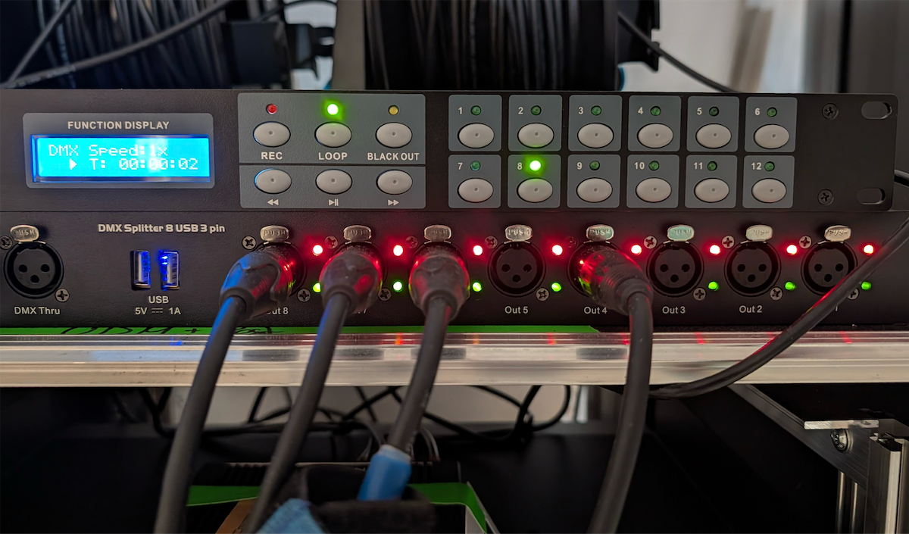 
</p>

<p align="center">
  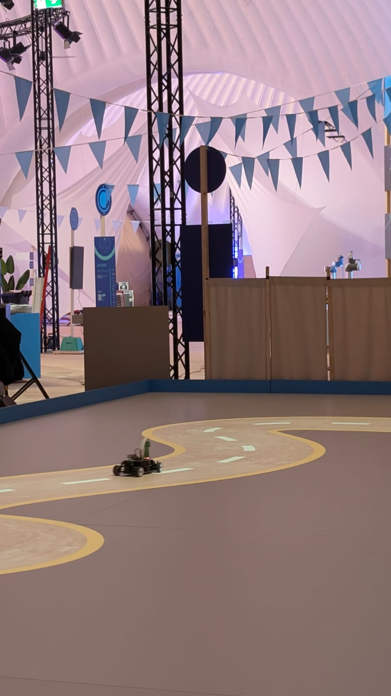 
</p>

### The car is stopped/stuck
This happens because of many updates queued for the car.
Simply move the AI multiplier on the Driving Interface to values higher than 1 (e.g., 1.10) until it starts to move, then move it back to 1.
<p align="center">
   
</p>

### After an accident, one of the car's front steering arm fell off
Stop the car (set `Mode: User` in the drive interface) and reinstall the steering arm as follows:
1. Gently turn the genlty turn the front wheel outward
2. Insert the steering arm it in the front differential
3. Insert the steering arm on the side of the wheel
4. Gently turn the genlty turn the front wheel inward

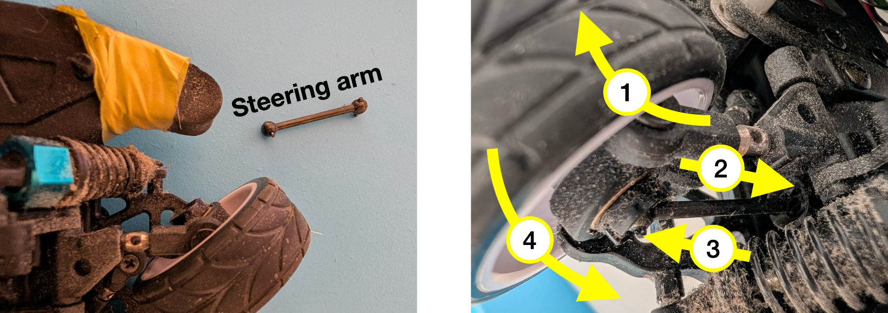

### The car unexpectedly shut down
During the exhibition, the car may occasionally shut down unexpectedly. This typically happens due to overheating of the Raspberry Pi unit.

If this occurs, the solution is straightforward:
1. Turn the car off and then on again using the `ON/OFF` switch.
2. After the reboot, restart all the connections **from both laptops**, following the procedure described in the guide.

This issue often occurs when the car is powered on but remains stationary for too long. To reduce the risk of overheating, it is recommended to let the car running for at least 5–10 minutes every hour.


### Path-ological touch screen is out of sync with the beamer (random updates not synchronized)
Restart the Path-Ological application, closing the terminal running it, open a new one, and run:
```bash
pnpm run dev
```
### Localhost address does not work
It is possible that another SSH session remained active and it generates conflicts. You can use an alternative page that is presented in the terminal while you are running the car. The address is
``` bash
piracer-x.local:8887
```

### Cannot refresh the cockpit
You can use the refresh all extension of Chrome to refresh also the pages that are in other screens, like the cockpit.
<p align="center">
  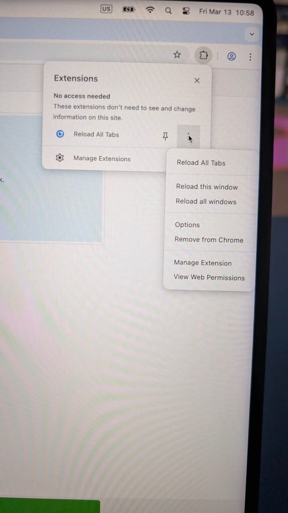 
</p>

<!-- 
### Python Errors while running the model
It is possible that, the environment got corrupted because of any wrong command used.
The first attempt is to re-generate the environment on the car:

``` bash
cd donkeycar
./setup_uv.sh
source .venv/bin/activate
```

If the error persists, you can create a new car
``` bash
cd ~
source donkeycar/.venv/bin/activate
rm -rf piracerpro
donkey createcar --path ~/piracerpro
```
-->

## Q & A

### Who built the exhibition? What hardware is used?

This exhibition is born as a spin-off of [#FormulaUSI](http://formulausi.si.usi.ch/), an autonomous self-driving car competition organized by the [Software Institute](https://si.usi.ch/) — [USI, Lugano](https://www.usi.ch/) in 2021 and 2022. 

The software that runs the autonomous driving is a [fork](https://github.com/formula-usi/donkeycar) of the [Donkey Car Framweork](https://docs.donkeycar.com/), implemented by [Samuele Pasini](https://pasinisamuele.github.io/) and [Dr. Roberto Minelli](https://robertominelli.com/), two researchers at the Software Institute. Path-ological — the software to dynamically changing the projected circuits — has been developed by [CodeLounge](https://codelounge.si.usi.ch/), the center for software research & development part of the Software Institute. 

The cars are [Waveshare PiRacer Pro](https://www.waveshare.com/piracer-pro-ai-kit.htm) — general purpose scale cars equipped with a [Raspberry Pi 4](https://www.raspberrypi.com/products/raspberry-pi-4-model-b/), a tiny computer. 

This project is funded by the [SNSF Agora](https://www.snf.ch/en/JnT2xEAERCgO8qQc/funding/science-communication/agora) project entitled ["Self-Driving Cars on Interactive Dynamic Tracks: An Exhibition at Phänomena 2026"](https://data.snf.ch/grants/grant/232355) obtained by Dr. Roberto Minelli and Prof. Paolo Tonella.


### What is the purpose of the Exhibition?
In our research, we work in AI testing. This is an autonomous driving simulator in which we show how to test AI driven cars in extreme condition (unseen circuits, circuits that change, extreme weather,...). This represent a testing scenario in which we show the potential and the limits of the AI in this field: how far can you push it?


### How the AI model works?
The AI model here is a Neural Network (more specifically, a **Convolutional Neural Network**, abbreviated as **CNN**) that is trained using the paradigm of **Imitation Learning**.
The concept of Imitation Learning is to collect data in which we demonstrate how to perform a specific action (in this case, driving the car) and teach the AI how to imitate it.
More specifically, the car has a camera on the front that collects pictures.
During the training phase, we drove the car for ~30 minutes using a PS4 Joystick. At every time step (5 times per second), we stored the image and the command that we were giving with the joystick. So we collected a dataset composed of triplets: (Picture, Throttle, Steering Angle), in which the Picture represents what the camera sees at a given moment, and the Throttle and the Steering Angle are the two commands given by the driver at the same moment.
For example, you can imagine that when the road in front of the car is completely straight, the Picture contains a straight road, the Throttle command will be 1.0 (full speed), and the Steering angle will be 0.0 (the car will go straight).
When the road in front of the car presents a curve to the left, the Picture contains this curve, the Throttle command will be lower than 1.0 (not full speed when you have to turn), and the Steering angle will be lower than 0 (the car will turn left).

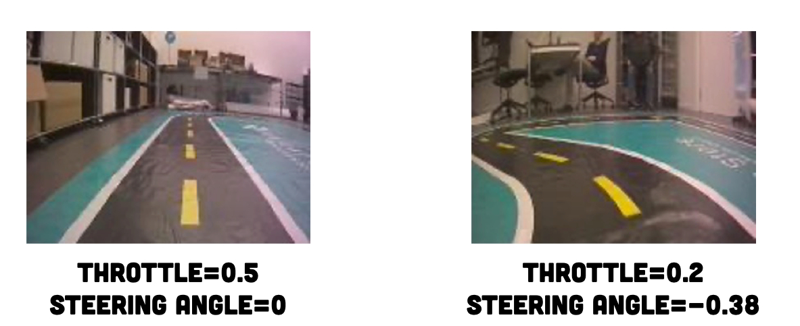

Once we collected all the data, we trained the AI model using a mathematical optimization algorithm named **Backpropagation**. Basically, the model learns, given the image, to predict the Throttle and the Steering Angle that the driver used at the moment the input picture was taken. Initially, it predicts the values randomly, but during the process, it becomes more and more precise. Once it has learned to predict these values with good performance, it has essentially learned how to drive.

### Is it possible to use other sensors apart from the Camera?
Sure, you can think about the human learning process: we use all our senses to capture data from the real world, and our intelligence works in a way that maps this sensory data to the actions we need to take.
In the same way, the car captures data using sensors. You can imagine that right now it captures data using only the camera, and it is like a human who only uses their eyes. But if we mount multiple sensors, it is like a human using ears as well, and other senses.
In this way, the decision about what to do will be more accurate.
However, we decided to stay with the camera instead of adding other sensors (like LiDAR or additional data sources) because of hardware limitations. To support more sensors, we would need a more powerful chip instead of a Raspberry Pi, maintenance would become more complex, and the battery duration would be dramatically reduced.


### Is the car still learning how to drive?
No, the training process is performed beforehand, when we collected the data using the PS4 Joystick and trained the model with Imitation Learning. Once the training is completed, the AI model is no longer improving.

### What happens if, during the data collection, the driver drives badly?
The result will be much worse, since the model will imitate a bad driver. We also applied a data cleaning procedure to eliminate the sections in which the driver made mistakes, in order to prevent the model from learning this incorrect behavior.

### How can the model deal with new circuits?
The trick is, during data collection, to expose the model to a large variety of circuits (one of us was driving, while the other was changing circuits with Path-Ological). In this way, it learns how to drive correctly in general (this property is named **generalization**), without specifically relying on the circuits the model has already seen during training (when this issue occurs, it is called **Overfitting**).
To prevent overfitting, we kept part of the collected data hidden and used it at the end of the training process to evaluate the generalization capabilities of the model on unseen data. Generalization, however, is not always perfect (this happens with every AI model, think about ChatGPT). If a circuit is very unusual or significantly different from what the car has seen during training, it is possible that it may collide or make an incorrect decision.


### Why is the car, sometimes, struggling to drive?
See the previous answer: if the circuit is very unusual or far from what the car has seen during training, it is possible that it may collide or make an incorrect decision. This is also related to the testing purpose of the exhibition, which wants to show the limits and the potentials of AI in autonomous driving.

### How do the different weathers work?
Since we cannot physically put ice and water on the circuit, we simulated these conditions by limiting the car's control under such scenarios. More specifically, we applied noise to the images so that the camera appears dirty or icy, and we added uncontrollable noise to the Steering Angle and Throttle, making the car unable to steer, accelerate, or decelerate perfectly. The noise is stronger under icy conditions.  

In this way, the AI model learns to drive more carefully under these conditions, adapting to the disturbances in the same way a human would.

### How can the model deal with different weathers?
The different circuit weathers are paired with different textures and colors. CNNs are very powerful models; while learning to drive in general, they also learn to map the specific visual appearance of the circuit to the correct driving behavior (e.g., how to drive on dry, wet, and icy surfaces). If all the circuits looked the same, this would be impossible. Think about humans: we cannot drive correctly on an icy road if it looks dry—we would be surprised and might crash.

### What happens if the light conditions change?
The car is quite sensitive to light conditions for two reasons. First, it was trained under specific lighting, so it can be “surprised” by changes (it’s like attending driving school only at night, then trying to drive during the day for the first time—you will be caught off guard). Second, under certain lighting, the beamer struggles to project the circuit clearly, making it almost invisible and much harder to follow.

### How is the autonomous driving regulated?
In Europe and Switzerland, the degree of automation is categorized into 6 levels:

0: No automation  
1: Driving assistance, like ABS  
2: Partial automation: the driver must constantly monitor the system, but receives support like LaneAssist or ACC (Adaptive Cruise Control)  
3: Conditional automation: the driver does not need to monitor the system constantly, but must be able to take control when requested; for example, systems that drive autonomously on highways  
4: High automation: no need to take control under normal conditions, but it may be required in special situations like heavy rain  
5: Full automation: cars of the future  

Currently, we are between level 2 and 3. Achieving more automation is difficult both for technical reasons and for ethical/legal concerns: if the car hits someone under full automation, who is responsible? The driver (who may have no way to control the car), the manufacturer, the AI developer? No one wants to be fully responsible.

### There are autonomous taxis in the US, but you said here we are between 2 and 3, how is it possible?
The US follows different regulations. The taxis used are not fully general; they fall into the overfitting problem (see first QA), since they have perfectly memorized the structure of a specific city, but they would not be able to drive in different contexts. This is acceptable for their requirements, but this is not what we aim for in autonomous driving research.
